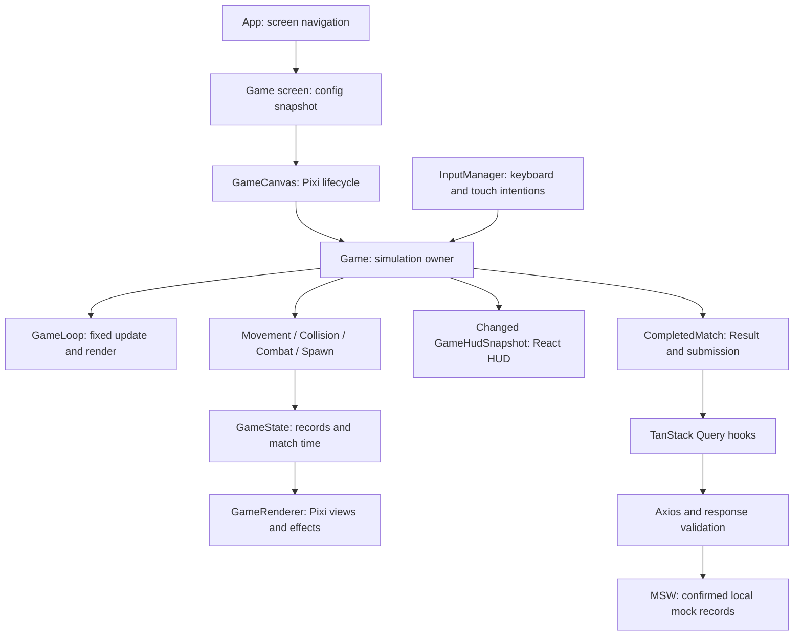

# Architecture — Pirate Battle

This describes the current implementation for the Jungle Gaming coding challenge. [README.md](README.md) contains setup and evaluator instructions.

## 1. Responsibilities and flow

React owns screens, forms, dialogs, accessible HUD presentation and remote-data UI. Game classes own continuous simulation; PixiJS owns graphical views. Ship coordinates, projectiles, weapon timers and enemies never live in React state.

[App.tsx](src/app/App.tsx) navigates using local React screen state, without a router/global gameplay store. The `Game` React screen and `game/core/Game` class have different responsibilities.

## 2. Initialization, teardown and lifecycle

[GameCanvas](src/components/GameCanvas.tsx) loads gameplay textures and creates a Pixi `Application` inside an effect. It uses `autoStart: false`, logical dimensions, `autoDensity` and device pixel ratio. CSS fits the fixed 960×600 arena to available space while preserving aspect ratio; there is no scrolling camera.

It appends the canvas, attaches `GameRenderer`, constructs the core `Game`, installs callbacks and calls `Game.start(config)`. Callback refs avoid recreating gameplay solely because a React callback identity changes. Loading/error states remain in React. Failed loading destroys textures that loaded successfully.

An effect cancellation flag handles asynchronous initialization finishing after unmount, including Strict Mode setup/cleanup/setup. Cleanup stops observation/gameplay, destroys renderer views and the Pixi application, removes the canvas, and destroys owned gameplay textures. `Game.destroy()` detaches input/pause listeners, clears effects and drops simulation references. Optional profiling checks resources after teardown.

`GameState.status` is `running`, `paused` or `finished`. `Game.pause()` stops the loop, silences gameplay audio, detaches/clears inputs and publishes pause state. Blur/hidden-tab listeners invoke it; focus return does not resume. `resume()` requires a visible, focused document and resets loop timestamps/accumulator, discarding paused time.

`PauseDialog` uses a native modal, explicit focus handling and a Tab boundary; Escape cannot implicitly dismiss it. It closes before Resume focuses the canvas, preventing browser focus restoration to Pause. Reused `OptionsForm(context="match")` changes audio/display only; Back keeps simulation paused.

`finishMatch()` marks finished once, detaches input/listeners and emits immutable `CompletedMatch` with a copied/frozen config. Time expiry records configured duration; death records elapsed active time. `App.navigate('result', payload)` saves the result and initiates registration. Abandonment destroys gameplay without generating a completion. Play Again remounts with new state/configuration.

## 3. Simulation versus rendering

[GameLoop](src/game/core/GameLoop.ts) owns one `requestAnimationFrame` chain. It accumulates elapsed time, calls `update(1 / 60)` zero or more times, then renders once. A 250 ms delta clamp bounds catch-up after stalls; severe stalls may discard time instead of building an unlimited backlog.

`Game.update()` runs only while active, caps the final step to remaining match time and subdivides movement when needed to limit collider crossing. Each step ages effects, advances match time, moves ships, resolves land collisions, updates player weapons, resolves existing projectiles, updates Shooters, applies Chaser contacts, then attempts spawning. Existing shots resolve before a killed Shooter can fire. New enemies begin AI on the next step.

The loop passes accumulator-derived `alpha`, but **GameRenderer currently ignores it** and copies current simulation positions. Fixed 60 Hz simulation is separate from actual rendering FPS.

[FrameCadence](src/game/core/FrameCadence.ts) stores at most 600 recent render intervals. With Show FPS enabled, completed-render cadence is published approximately once per second. Start/stop resets it; disabling the observer removes sampling work. There is no extra measurement RAF or per-frame React state update.

## 4. Records, input and systems

Runtime ships/projectiles are typed plain records in [domain.ts](src/types/domain.ts), stored in `GameState` Maps. Islands hold local circle colliders. Factories `createPlayer`, `createChaser`, `createShooter`, `createProjectile` receive match tuning without hidden default imports. No ECS, physics engine or entity wrapper hierarchy is used.

[InputManager](src/game/input/InputManager.ts) stores held keys and pointer-ID intentions. `InputSnapshot` combines forward/turn/fire booleans and optional screen-space `touchDirection`. Listeners attach during active simulation and detach/reset on pause/end/destroy. Interactive/editable elements retain native key behavior; keyup still releases held keys after focus moves. Repeated keydown cannot restore cleared input after pause.

[TouchControls](src/components/TouchControls.tsx) handles PointerEvents, capture, dead zone and independent joystick/attack lifetimes. It sends intentions through `GameCanvasControls`; systems do not depend on DOM events. Cancel, resize and unmount clear touch input. Releasing an attack finger does not release movement.

[MovementSystem](src/game/systems/MovementSystem.ts) defines forward as `(sin(rotation), -cos(rotation))`: zero points upward. Keyboard steering uses configured radians per second. Touch heading is `atan2(x, -y)`; `atan2(sin(difference), cos(difference))` selects the shortest turn. Turning is capped by existing rotation speed with a 0.01-radian alignment tolerance. Vector magnitude supplies forward throttle; no reverse. Keyboard turn wins on hybrid devices; keyboard forward supplies full throttle.

Enemies pursue the player; Shooters stop approaching within attack range. A local detour handles the isolated island; edge peninsulas use collision resolution/sliding. This is simpler than general pathfinding and limits more complex maps.

[CollisionSystem](src/game/systems/CollisionSystem.ts) pushes ship overlaps outside island circles. `firstProjectileHit()` tests the actual movement segment against expanded circles and selects earliest contact, preventing shot tunneling. Land wins ties. Player shots target enemies; enemy shots target the player. Chaser overlap generates contact damage.

[SpawnSystem](src/game/systems/SpawnSystem.ts) owns `SeededRandom`, countdown and enemy ID sequence. Each interval chooses a weighted type and tries bounded positions. `isValidPosition()` excludes boundaries, islands, enemies and a minimum player distance. Failed placement skips that interval; overdue updates do not create a spawn burst. Seed is repeatable, but input changes outcomes.

## 5. Combat and scoring

[CombatSystem](src/game/systems/CombatSystem.ts) implements:

- Front cannon: one shot. Each broadside: three parallel shots with configured spacing/offsets.
- Independent front/left/right simulation cooldowns; defaults 0.3 s front and 1 s per broadside.
- Individual Shooter cooldowns, projectile tuning and attack range.
- `applyCollision()`: HP clamping and immediate removal of dead enemies.
- Player-owned projectile kills: **+1**, from default `enemyKillRewards` for either type; increment `enemiesDefeated` once.
- Chaser contact: player damage and Chaser removal/explosion, **+0 score**, no player-kill increment.

`Game.updateProjectiles()` consumes a shot before damage, or removes it on expiry/arena exit. This prevents duplicate damage. Finished state prevents further movement, cooldown progress, damage, spawning and scoring. Gameplay tuning comes from the match snapshot; visual/audio events do not affect balance.

## 6. Rendering, assets and effects

[GameRenderer](src/game/rendering/GameRenderer.ts) manages layers and ID-to-view Maps for islands, enemies, shots and health bars. Views share textures and disappear with their simulation records. Ship anchors are centered. Player uses **2 → 8 → 14**, Chaser **1 → 7 → 13**, Shooter **3 → 9 → 15**. HP at/below two thirds and one third selects damaged/critical artwork without modifying hitboxes.

[gameAssets.ts](src/game/assets/gameAssets.ts) centralizes paths and decodes images once per canvas lifetime. Water uses the official tile, enlarged and softened over sea color. Island geometry drives both circular coast visuals and collision/spawn validation; vegetation/fortification are decorative. The map has two peninsulas and a small upper-right cover island.

[CombatEffects](src/game/rendering/CombatEffects.ts) provides firing, impact, flash and explosions with official artwork. Explosion images form a presentation sequence, not a supplied animation atlas. [ProjectileTrails](src/game/rendering/ProjectileTrails.ts) records actual segments clipped at impact. Ages use simulation time, freezing on pause and clearing on restart/teardown.

`menuAssets`, `hudAssets`, `touchAssets`, `audioAssets` centralize other paths. Shared `PirateUI.css` uses nine-slice buttons, scaling corners uniformly with sprite height while stretching the center. Button cuts came from inspected PNGs; panel borders use atlas metadata. The supplemental battle background is Main Menu only. Complete asset source/license evidence remains a delivery check.

## 7. HUD and audio

`createHudSnapshot()` freezes HP/max HP, score, rounded remaining seconds, status and finish reason. `Game.publishHud()` compares fields before invoking React. Coordinates never cross this boundary. Game's HTML `dl` exposes values outside canvas; only state changes use a live status region. Health bars stay in Pixi. Damage/score can publish real changes without an unconditional render-frequency React update.

[AudioManager](src/audio/AudioManager.ts) exposes shared `gameAudio`. Trusted pointer/key gestures create/resume one Web Audio context and load WAVs with abortable fetches. Buffers are reused; playback creates separate sources so cannon tails overlap. Effects are capped at 12 voices; UI overlap at two. Separate gains control effects/ocean; UI uses reduced gain through effects.

Combat sounds come from actual events, not React render changes. `start`, `pause`, `resume`, `finish`, `leave` manage session playback/ambience. Blur/hidden tab silences playback. Completion tails may survive the immediate Result transition. `uiSounds` delegates UI hover/activation and avoids duplicate touch hover feedback.

Context/buffers intentionally survive navigation. `attach()` returns app-level cleanup that removes listeners, aborts loads, disconnects resources and closes the context. Missing audio/autoplay restrictions leave gameplay available; unavailable combat sounds are dropped rather than queued.

## 8. Configuration and persistence

[gameConfig.ts](src/config/gameConfig.ts) holds typed tuning/defaults. `OptionsForm` validates duration 60–180 s and spawn 1–15 s. `gameOptions.ts` stores only those fields in a versioned record, safely defaulting invalid values.

The Game screen reads options in a lazy state initializer; `Game.start()` copies top-level/nested records. Later preferences cannot mutate its snapshot. Audio/display are separate stores using `useSyncExternalStore`; immediate changes do not remount gameplay.

| Module | Stored data |
| --- | --- |
| `gameOptions.ts` | Duration/spawn options. |
| `audioPreferences.ts` | Mute and volumes. |
| `displayPreferences.ts` | Show FPS, default false. |
| `completedMatchStorage.ts` | Last local result, independent of submission. |
| `confirmedMatchesStorage.ts` | Records accepted by the mock. |
| `pendingMatchesStorage.ts` | Original payloads awaiting confirmation. |
| `networkScenarios.ts` | Demo scenario/target. |

Reads validate unknown data; invalid records are never silently submitted. Writes surface storage errors. Failed pending persistence stops submission and retains the payload in page memory with a warning. Stores are per browser/origin, without live cross-tab synchronization or a shared remote authority.

## 9. HTTP, queries and recovery

[client.ts](src/api/client.ts) creates Axios with `/api`, strict JSON parsing and a 10-second timeout. It awaits `ensureMockWorkerReady()` before requests. `mocks/browser.ts` shares concurrent activation, probes `/api/mock-status` and restarts stale interception through public MSW APIs. Startup failure warns but still mounts UI; later requests can recover.

MSW 3 uses Service Workers on suitable origins and Fetch/XHR fallback where unavailable. The committed worker serves `/mockServiceWorker.js`; implemented endpoints need no real backend. Unhandled requests bypass mocking.

[responseValidation.ts](src/api/responseValidation.ts) validates unknown list/submission responses before returning typed values. Malformed responses cannot become accepted data through a TypeScript cast.

`toSubmitMatchRequest()` converts local `CompletedMatch.elapsedSeconds` to API `durationSeconds`, removes local `registrationStatus` and adds `playerId`/`playerName`. `SubmitMatchRequest` is `MatchHistoryRecord`: match ID, completion date, score, defeated count, active duration, end reason, final HP, full config and player identity. `RankingEntry` adds `rank`. POST returns 201 for a newly accepted record or 200 for an identical retry. GET Ranking accepts `page`, `pageSize`, `configKey`; History accepts pagination and `playerId`.

Shared `PaginatedResponse<T>` contains `items`, `page`, `pageSize`, `total`, `totalPages`. [handlers.ts](src/mocks/handlers.ts) filters/orders before slicing; empty results have zero pages. `PaginationControls` handles empty/single-page navigation. Screens request five records.

`getGameConfigKey()` sorts keys recursively and serializes the **whole** config. Ranking compares that canonical identity, orders score descending, active duration ascending, completion date ascending, match ID ascending and assigns global ranks before pagination. History filters the local player, ordering date descending then ID ascending.

[useApi.ts](src/hooks/useApi.ts) keys Ranking by page/pageSize/config and History by player/page/pageSize. Queries forward AbortSignal to Axios. `ReactQueryProvider` sets one-minute stale time, one query retry and no window-focus refetch; lists refetch on mount. Separate page keys prevent delayed data overwriting another page. Cached records may coexist with a refetch error. React stores page navigation, not duplicate remote lists.

Submission flow:

1. `useSubmitMatch()` calls `addPendingMatch()` before POST.
2. An in-flight Map deduplicates equal concurrent payloads by ID; conflicts fail.
3. `registerMockMatch()` persists acceptance before updating memory. Equal ID/data returns existing record; different data returns 409; storage failure returns 503.
4. `submitMatch()` validates the response matches the original payload.
5. Success updates session registration, attempts pending removal and invalidates Ranking/History prefixes. Failure keeps pending data; POST retry is explicit.

`usePendingMatches()` subscribes to local pending state. Result/Menu provide per-record retry; refresh neither sends them automatically nor inserts them into confirmed lists. `useMatchRegistration()` is session query state, not a persisted confirmation receipt.

`networkScenarios` captures selection once per request and supplies deterministic delays/failures. Handlers snapshot lists before delays to reproduce stale-response races. Post-confirmation timeout stores acceptance before delaying. Multiple-pages fixtures are response-only. Reset cancels list requests, clears confirmed/pending data and removes/resets relevant cache entries; submission blocks reset. README lists scenario names/recovery steps.

## 10. Testing

[playwright.config.ts](playwright.config.ts) owns a dev server on 5175 with profiling disabled and bounded workers. Chromium is the project; mobile cases emulate touch/viewports. Browser contexts isolate storage. Traces are retained on first failure even without local retries; HTML is generated/ignored.

Coverage includes navigation/options (`app`, `pirateScreens`, `optionsFps`), combat boundaries (`gameplayBoundaries`), touch (`touchControls`), rendering/effects (`arenaVisuals`, `combatFeedback`, `projectileTrails`), audio (`audio`) and remote recovery (`ranking`, `confirmedMatches`, `pendingMatches`, `networkScenarios`, `networkReset`, `fixtureSemantics`). `mobileLan` uses a real non-loopback HTTP origin. Versioned snapshots cover stable arena, buttons, Pause, Result and lists.

Some deterministic tests import modules, stop RAF and invoke fixed updates or construct controlled arrangements/tuning. Systems and real inputs remain exercised; these differ from unaccelerated production profiling/physical-phone validation. Tests await canvas readiness before active controls and decode visual assets before screenshots.

Latest recorded full result: **164 passing**, with **42 passing repeat executions** of prior failures. Historical counts refer to their own builds. No full suite rerun is required for this documentation-only change.

## 11. Production profiling and trade-offs

[playwright.profile.config.ts](playwright.profile.config.ts) is separate: `profiling/production.spec.ts`, one worker and optimized preview on 4173. `.env.profiling` enables dynamic `attachProfile()`; normal builds exclude hooks. Show FPS remains independent.

[profileSession.ts](src/game/profiling/profileSession.ts) observes completed renders with at most 100,000 intervals and 1,000 entity samples. Maxima are observed per render, not every simulation tick. Pilot intentions use the same touch path without HP/state bypasses. Valid Options/seed and normal damage/spawning run on real time; early death is recorded honestly.

Five UI-driven start/play/exit cycles collect CDP post-GC heap/DOM/listeners and owned Game/Pixi/texture/audio counts. They exclude VRAM, worker heap and total browser RSS. Shared audio context/cache is intentional; small heap growth alone proves neither a leak nor its absence.

`profiling/run.mjs` archives prior output and writes validation JSON; default output also regenerates Markdown. Custom directories preserve the report. `probe-gpu.mjs` and harness record WebGL renderer/CDP status; `PROFILE_REQUIRE_GPU=1` rejects software fallback. `compare.mjs` compares named recorded workload directories. Commands/build identifiers are in [PERFORMANCE_REPORT.md](PERFORMANCE_REPORT.md).

Native 180-second profiling used light 15-second spawning; standard/dense attempts ended early. Headless AMD/D3D11 and historical SwiftShader are separate environments, not physical-phone/visible Chrome benchmarks. Current-position rendering, local AI/circle approximations, large bundle, incomplete dense survival profiling, licensing and unverified deployment are explicit trade-offs/checks. No performance claim follows merely from the FPS UI or test count.

Personal History excludes the three legacy local demo fixtures; they remain reserved Ranking fixtures. New players therefore see an empty History, while accepted/persisted matches and explicit Multiple pages scenario records retain ordering, filtering and pagination. UI activation audio can retain only the latest cue for up to three seconds during initial decoding; hover and combat are never queued. Audio still requires a trusted browser gesture.

MenuAssetLoader gates the initial UI behind shared menu image decoding with progress subscriptions cleaned up on unmount and explicit retry. LoadingScreen shares the background and semantic progress bar with GameCanvas. Arena progress counts successfully created textures, reserving one final step for Pixi initialization. Initial HTML loading is indeterminate while bootstrap/MSW starts. No artificial delays or gameplay clocks drive these bars.
